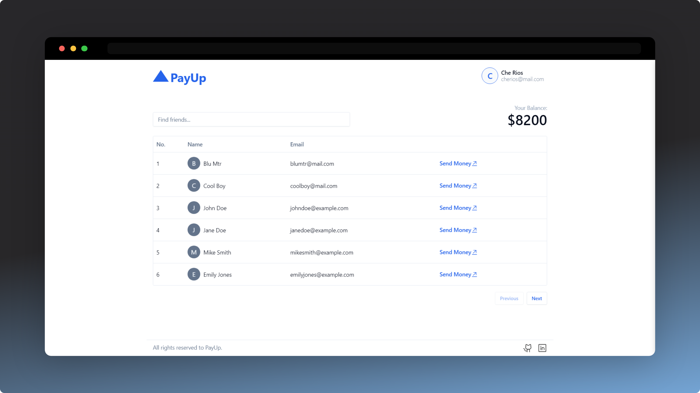

# 🔼 PayUp

A PayPal like web app built using the MERN stack.

**Try it here 👉** https://payup-hxd.netlify.app/

 

## 🧰Tech used

- 💻Frontend
  - React
  - React Router
  - TypeScript
  - Shadcn UI
  - TailwindCSS
- 🗃 Backend
  - Express.js
  - Mongoose
  - Zod

## 🛠 Setup locally

_Will update this soon_

## 🧠Takeaways

This was my first time using libraries like mongoose, zod, react-router, and shadcn-ui. I've learned a lot while creating this project and, honestly a little difficult for me to unpack it all in a github readme. I'd love to write a blog about all my learnings sometime soon, and once I do, I'll be sure to post a link to it on here. Additionally, I want to thank [@hkirat](https://github.com/hkirat) for his amazing 100xdevs cohort.

 

<strong>⭐ Leave a star maybe? ⭐</strong> 

<a href="https://github.com/buneeIsSlo/payup">Source</a>
| <a href="https://twitter.com/slo_bunee" target="_blank">Twitter </a>
| <a href="https://www.linkedin.com/in/bunee-dev/" target="_blank">LinkedIn </a>
| <a href="https://github.com/buneeIsSlo" target="_blank">Other Projects </a>

